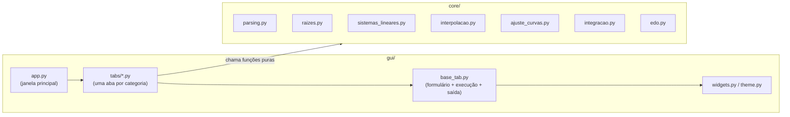

<div align="center">

# Métodos Numéricos Computacionais

**Aplicação desktop para resolução de problemas clássicos de Cálculo Numérico**,
construída em Python com interface gráfica moderna via CustomTkinter.

[](https://www.python.org/)
[](https://github.com/TomSchimansky/CustomTkinter)
[](https://www.sympy.org/)
[](https://numpy.org/)

[](#licença)
[](#instalação)
[](#)

</div>

---

## Sumário

- [Objetivo](#objetivo)
- [Métodos implementados](#métodos-implementados)
- [Instalação](#instalação)
- [Como executar](#como-executar)
- [Estrutura de arquivos](#estrutura-de-arquivos)
- [Arquitetura](#arquitetura)
- [Sintaxe das funções](#sintaxe-das-funções)
- [Exemplos rápidos](#exemplos-rápidos)
- [Tratamento de erros](#tratamento-de-erros)
- [Expandindo com novos métodos](#expandindo-com-novos-métodos)
- [Licença](#licença)

---

## Objetivo

Este repositório reúne, em uma única aplicação desktop, os principais métodos
estudados em disciplinas de **Cálculo Numérico / Métodos Numéricos Computacionais**,
cobrindo a ementa completa da matéria:

> Erros · Sistemas Lineares · Equações Algébricas e Transcendentes · Interpolação ·
> Integração Numérica · Equações Diferenciais Ordinárias · Ajuste de Curvas

A proposta é servir tanto como **ferramenta de estudo** — permitindo visualizar o
passo a passo de cada iteração, erro estimado e convergência — quanto como
**referência de implementação limpa** dos algoritmos clássicos, com o núcleo
matemático totalmente desacoplado da interface gráfica.

---

## Métodos implementados

<table>
<tr>
<td valign="top" width="50%">

### 🔍 Raízes de Funções
- Bisseção
- Newton-Raphson (derivada simbólica via SymPy)
- Método das Cordas
- Método de Pégaso
- Iteração Linear

### 🧮 Sistemas Lineares
- Eliminação de Gauss (com pivoteamento parcial)
- Gauss-Seidel

### 📈 Interpolação
- Interpolação Linear
- Interpolação Quadrática
- Interpolação de Lagrange
- Diferenças Divididas de Newton

</td>
<td valign="top" width="50%">

### ∫ Integração Numérica
- Regra dos Trapézios
- Regra 1/3 de Simpson
- Regra 3/8 de Simpson
- Quadratura Gaussiana (2 pontos)

### 📉 Ajuste de Curvas
- Regressão Linear Simples (mínimos quadrados)
- Regressão Linear Múltipla (mínimos quadrados)

### 🌀 Equações Diferenciais Ordinárias
- Método de Euler
- Runge-Kutta de 2ª ordem
- Runge-Kutta de 4ª ordem

</td>
</tr>
</table>

Cada método exibe, na área de resultados:

- **Histórico completo de iterações** (tabela formatada)
- **Estimativa de erro** a cada passo
- **Resultado final** destacado
- **Mensagens de erro claras** em caso de falha de convergência, divisão por zero ou entrada inválida

---

## Instalação

### Pré-requisitos

- Python **3.10** ou superior
- `pip` atualizado

### Passo a passo

```bash
# 1. Clone o repositório
git clone https://github.com/theotavio/metodos-numericos.git
cd metodos-numericos

# 2. (Recomendado) Crie um ambiente virtual
python -m venv venv

# Linux / macOS
source venv/bin/activate

# Windows
venv\Scripts\activate

# 3. Instale as dependências
pip install -r requirements.txt
```

### Dependências

| Biblioteca | Versão mínima | Finalidade |
|---|---|---|
| [CustomTkinter](https://github.com/TomSchimansky/CustomTkinter) | 5.2.0 | Interface gráfica moderna |
| [SymPy](https://www.sympy.org/) | 1.12 | Parsing de expressões e derivação simbólica |
| [NumPy](https://numpy.org/) | 1.26 | Álgebra linear e operações matriciais |

---

## Como executar

Com o ambiente virtual ativado e as dependências instaladas, basta rodar:

```bash
python src/main.py
```

A janela principal abrirá com abas para cada categoria de métodos. Selecione o
método desejado no menu suspenso, preencha os parâmetros no formulário à
esquerda e clique em **▶ Executar**.

---

## Estrutura de arquivos

```
metodos-numericos/
│
├── src/
│   ├── main.py                    # Ponto de entrada da aplicação
│   │
│   ├── core/                      # Núcleo matemático — 100% independente de GUI
│   │   ├── parsing.py             # Conversão de strings em expressões (SymPy)
│   │   ├── raizes.py              # Bisseção, Newton-Raphson, Cordas, Pégaso, Iteração Linear
│   │   ├── sistemas_lineares.py   # Eliminação de Gauss, Gauss-Seidel
│   │   ├── interpolacao.py        # Linear, Quadrática, Lagrange, Diferenças Divididas
│   │   ├── ajuste_curvas.py       # Regressão linear simples e múltipla
│   │   ├── integracao.py          # Trapézios, Simpson 1/3 e 3/8, Quadratura Gaussiana
│   │   └── edo.py                 # Euler, Runge-Kutta 2ª e 4ª ordem
│   │
│   └── gui/                       # Camada de interface gráfica (CustomTkinter)
│       ├── app.py                 # Janela principal e montagem das abas
│       ├── base_tab.py            # Classe base compartilhada por todas as abas
│       ├── theme.py               # Paleta de cores, fontes e estilos
│       ├── widgets.py             # Componentes reutilizáveis (campos, cartões, badges)
│       └── tabs/                  # Uma aba por categoria de métodos
│           ├── raizes_tab.py
│           ├── sistemas_tab.py
│           ├── interpolacao_tab.py
│           ├── ajuste_tab.py
│           ├── integracao_tab.py
│           └── edo_tab.py
│
├── requirements.txt                # Dependências do projeto
├── .gitignore
└── README.md
```

---

## Arquitetura

O projeto segue uma separação estrita entre **lógica matemática** e
**apresentação**, permitindo reutilizar o núcleo (`core/`) em qualquer outro
contexto — testes automatizados, CLI, notebooks — sem depender de Tkinter.



Cada função do `core/` segue um contrato de retorno padronizado:

```python
{
    "sucesso": bool,       # se o método convergiu / executou com êxito
    "resultado": Any,      # valor final (raiz, solução, integral, pontos, etc.)
    "historico": list[str],# log de iterações formatado para exibição
    "erro": str | None,    # mensagem de erro, quando sucesso é False
}
```

Isso torna trivial adicionar uma nova aba na GUI sem tocar no núcleo, ou
adicionar um novo método sem tocar na interface.

---

## Sintaxe das funções

As funções matemáticas são digitadas em notação **Python/SymPy** e convertidas
automaticamente:

| Você digita | SymPy interpreta como |
|---|---|
| `x**3 - x - 2` | $x^3 - x - 2$ |
| `sin(x) - x/2` | $\sin(x) - x/2$ |
| `exp(-x) - x` | $e^{-x} - x$ |
| `(x+2)**(1/3)` | $\sqrt[3]{x+2}$ |
| `y - t**2 + 1` | $f(t,y) = y - t^2 + 1$ (para EDOs) |

Operadores suportados: `+ - * / ** sqrt() sin() cos() tan() exp() log() abs()`,
entre outros do SymPy. A multiplicação implícita (`2x`) também é aceita.

---

## Exemplos rápidos

<details>
<summary><strong>Raiz de √2 pelo método da Bisseção</strong></summary>

| Campo | Valor |
|---|---|
| f(x) | `x**2 - 2` |
| a | `1` |
| b | `2` |
| Tolerância | `1e-6` |
| Máx. iterações | `100` |

**Resultado esperado:** `x ≈ 1.4142141342` (valor real: 1.41421356...)

</details>

<details>
<summary><strong>Sistema linear 3×3 pela Eliminação de Gauss</strong></summary>

Matriz `A` e vetor `b`:

```
 2   1  -1  |   8
-3  -1   2  | -11
-2   1   2  |  -3
```

**Resultado esperado:** `x1 = 2`, `x2 = 3`, `x3 = -1`

</details>

<details>
<summary><strong>PVI dy/dt = y - t² + 1 pelo método de Euler</strong></summary>

| Campo | Valor |
|---|---|
| f(t, y) | `y - t**2 + 1` |
| t0 | `0` |
| y0 | `0.5` |
| tn | `2` |
| h | `0.2` |

**Resultado esperado:** `y(2) ≈ 4.8657`

</details>

---

## Tratamento de erros

A aplicação valida entradas e captura falhas comuns antes que travem a
execução, exibindo mensagens claras na área de resultados:

- Campos vazios ou não numéricos
- Intervalo `[a, b]` sem troca de sinal (métodos de raízes)
- Divisão por zero (derivada nula, pivô nulo, diagonal nula)
- Matrizes com dimensões incompatíveis ou singulares
- Não convergência dentro do número máximo de iterações
- Número de subintervalos incompatível com o método (ex: Simpson 1/3 exige `n` par)

---

## Expandindo com novos métodos

1. Implemente a função pura em `src/core/<categoria>.py`, retornando o
   dicionário padrão (`sucesso`, `resultado`, `historico`, `erro`).
2. Na aba correspondente em `src/gui/tabs/`, registre o método no dicionário
   `metodos_disponiveis` e ajuste `_montar_formulario` / `_executar` se
   precisar de novos campos.
3. Nenhuma outra alteração é necessária — a classe base (`base_tab.py`) cuida
   da exibição do histórico, badge de status e tratamento de exceções.

---

## Licença

Distribuído sob a licença MIT. Veja mais detalhes no arquivo `LICENSE`.

<div align="center">

Feito para apoiar o estudo de **Métodos Numéricos Computacionais**.

</div>